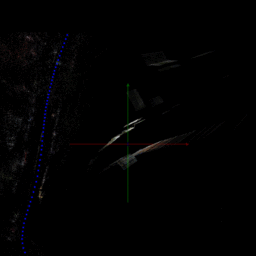

# DashCam_python
A project about dashcam implemented by Python
- [paper on eccv'16 workshop](http://link.springer.com/chapter/10.1007/978-3-319-46604-0_10)
- [intro video](https://www.youtube.com/watch?v=qeIMMk8E17o)

## Current pipeline
1. Fetch the Google data (Use info_3d)
2. Transform the point in SFM to Google (SV3D)
3. Align the SFM with Google (By sfm3DRegion.matrix)
4. Output the trajectory in (lat, lon, h)/(x, y, z) form
5. Fetch the Google data (Use trajectory)
6. Create the SV3D according to trajectory(Now, it's important to use the correct anchor!!)
7. Output the ply file of SV3D constructed from trajectory
- More details in [pipeline](src/pipeline.pptx)

## Important
- Code under example/new_system_pipeline
- Three major coordinate
  1. sfm coordinate
  2. street view 3D in gl (x-y plan, z up to sky) 
  3. ['geographic coordinate system'](https://en.wikipedia.org/wiki/ECEF)
- 
- TODO:
  - Fetch the Google data for trajectory (files lacked anchor's data)
  - Fix python2 to python3 some problem...

## Model Simplify
- Index map split
- 
- 
- 
- 
- TODO:
  - structure the point cloud data
  - down sample single pano
  - adjust different pano relative position

## Work record
- new_system 0~8: [pipeline](src/pipeline.pptx)
- novel_vew 9~11: [street_overview](src/pipeline.pptx)